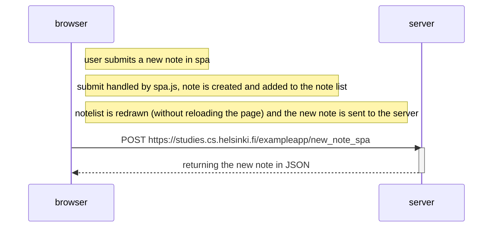

```mermaid
sequenceDiagram
    participant browser
    participant server

    Note right of browser: user submits a new note in spa
    Note right of browser: submit handled by spa.js, note is created and added to the note list
    Note right of browser: notelist is redrawn (without reloading the page) and the new note is sent to the server
    
    browser->>server: POST https://studies.cs.helsinki.fi/exampleapp/new_note_spa
    activate server
    server-->>browser: returning the new note in JSON
    deactivate server 
   
```